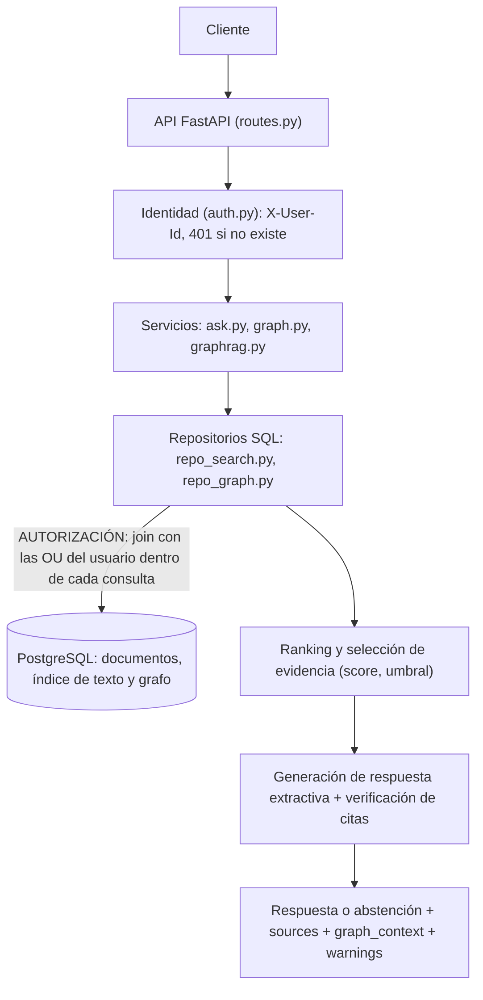
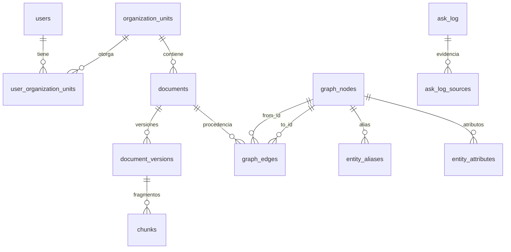

# Docuvex Challenge Técnico: búsqueda, RAG y Memoria Grafo

Versión acotada de un buscador inteligente de documentos con grafo de relaciones. La regla central es que un usuario solo ve información de sus unidades organizacionales (OU) por cualquier vía: búsqueda, respuesta, evidencia o grafo.

- **Stack:** Python 3.12, FastAPI, PostgreSQL 16, pytest, Docker Compose.
- **Un solo almacén:** PostgreSQL guarda documentos, índice de texto completo y grafo, con un único mecanismo de autorización para todo.
- **Sin servicios externos:** por defecto no usa LLM, Internet ni API keys. La respuesta es extractiva.
- **Estado:** todo lo obligatorio, lo recomendado y lo opcional está implementado: extracción automática de entidades, generador con LLM (con modo simulado sin Internet) y frontend. Además, Row-Level Security como segunda barrera de autorización. Riesgos y pendientes en [NOTAS.md](NOTAS.md).

## 1. Cómo ejecutar

Requisitos: Docker con Docker Compose v2. Nada más.

```bash
cp .env.example .env
docker compose up --build
```

La API queda en `http://localhost:8000` y la página de demostración en la misma dirección, en `/`. El esquema se crea y el dataset del Anexo A (`data/dataset.json`) se carga solo al iniciar.

Tests (no requieren Internet ni API keys):

```bash
docker compose run --rm --build api pytest
```

Casos de aceptación del Anexo B contra la API levantada (solo necesita Python 3, sin dependencias):

```bash
python3 scripts/verificar_anexo_b.py http://localhost:8000
```

Variables de entorno (`.env.example` trae valores ficticios):

| Variable | Uso |
|---|---|
| `POSTGRES_USER`, `POSTGRES_PASSWORD`, `POSTGRES_DB` | Credenciales de la base local |
| `DATABASE_URL` | Conexión de la API a PostgreSQL |
| `DATASET_PATH` | Ruta del dataset que se carga al iniciar |
| `API_PORT` | Puerto publicado en el host (8000 por defecto) |
| `LOG_LEVEL` | Nivel de log |
| `AUTO_EXTRACT` | `true` (por defecto) ejecuta la extracción de entidades por reglas al cargar |
| `ANSWER_MODE` | `extractive` (por defecto), `llm-fake` (LLM simulado) o `llm` (Claude) |
| `ANTHROPIC_API_KEY`, `LLM_MODEL` | Solo para `ANSWER_MODE=llm`. La clave va vacía en `.env.example` |

## 2. Endpoints

Todos exigen el encabezado `X-User-Id`. Sin encabezado o con un usuario inexistente la respuesta es 401.

| Método y ruta | Qué hace |
|---|---|
| `POST /api/v1/search` | Chunks relevantes dentro del alcance del usuario |
| `POST /api/v1/ask` | Respuesta con evidencia y fuentes, o abstención |
| `GET /api/v1/graph/nodes/{node_id}/neighbors` | Vecinos de un nodo, con camino y procedencia |
| `GET /api/v1/graph/nodes?name=` | Resolución de entidades por nombre o alias |
| `GET /api/v1/documents/{document_id}` | Metadatos: versiones, versión vigente y OU |
| `GET /` | Página de demostración (no requiere encabezado; los datos sí) |

```bash
# Búsqueda. limit entre 1 y 20 (5 por defecto). include_history es opcional.
curl -s -X POST localhost:8000/api/v1/search \
  -H 'Content-Type: application/json' -H 'X-User-Id: user-a' \
  -d '{"query": "¿Cuál es la duración del contrato?", "limit": 5}'

# Pregunta con respuesta
curl -s -X POST localhost:8000/api/v1/ask \
  -H 'Content-Type: application/json' -H 'X-User-Id: user-a' \
  -d '{"question": "¿Cuál es la duración del contrato con GPS Legal?"}'

# Pregunta cuya respuesta existe solo en otra OU: abstención
curl -s -X POST localhost:8000/api/v1/ask \
  -H 'Content-Type: application/json' -H 'X-User-Id: user-a' \
  -d '{"question": "¿Cuál es el sueldo del gerente general?"}'

# Pregunta que usa el grafo
curl -s -X POST localhost:8000/api/v1/ask \
  -H 'Content-Type: application/json' -H 'X-User-Id: user-a' \
  -d '{"question": "¿Qué documentos están relacionados con el contrato de GPS Legal?", "use_graph": true}'

# Vecinos en el grafo. depth 1 o 2; relation es opcional.
curl -s 'localhost:8000/api/v1/graph/nodes/doc-001/neighbors?depth=2' -H 'X-User-Id: user-a'

# Resolución de entidades
curl -s 'localhost:8000/api/v1/graph/nodes?name=GPS%20LEGAL%20S.p.A.' -H 'X-User-Id: user-a'

# Metadatos de un documento
curl -s localhost:8000/api/v1/documents/doc-008 -H 'X-User-Id: user-a'
```

Errores, siempre con el mismo formato:

```json
{ "error": { "code": "NOT_FOUND", "message": "Recurso no encontrado." } }
```

| Código | Cuándo |
|---|---|
| 400 `VALIDATION_ERROR` | Request inválido (FastAPI responde 422 por defecto; se reemplazó) |
| 401 `UNAUTHORIZED` | Sin `X-User-Id` o usuario inexistente |
| 404 `NOT_FOUND` | Recurso inexistente o no autorizado, con cuerpo idéntico |
| 500 `INTERNAL_ERROR` | Error interno, sin trazas ni detalles |

## 3. Arquitectura



La autorización se aplica en un solo punto: la flecha entre repositorios y base de datos. Todo lo que está más arriba trabaja únicamente con filas ya autorizadas.

```
src/app/
├── main.py         arranque, esquema, carga del dataset, log de acceso
├── routes.py       rutas y validación del request (sin SQL)
├── auth.py         identidad a partir de X-User-Id
├── errors.py       formato único de error
├── repo_search.py  SQL de chunks y documentos, con alcance de usuario
├── repo_graph.py   SQL del grafo: subgrafo visible del usuario
├── ask.py          selección de evidencia, abstención, generador, verificación
├── graph.py        traversal acotado (profundidad, tope de nodos, ciclos)
├── graphrag.py     uso del grafo en /ask
├── versions.py     regla de versión vigente
├── seed.py         carga del Anexo A
├── extraction.py   extracción de entidades y relaciones por reglas (opcional)
├── llm.py          generador con LLM: simulado y Claude (opcional)
├── text.py         normalización de texto
├── schema.sql      modelo de datos, índices y políticas de Row-Level Security
└── static/         página de demostración (opcional)
tests/              133 tests, nombrados con el ID de la regla que protegen
scripts/            verificador del Anexo B contra la API en ejecución
docs/diseno.md      documento de diseño
```

## 4. Seguridad: dónde se aplica la autorización

**En la consulta SQL.** Toda función de repositorio que lee documentos, versiones, chunks, nodos o relaciones recibe `user_id` como parámetro obligatorio y hace join con `user_organization_units`. No existe ninguna función que lea esos datos sin alcance de usuario. El cliente nunca envía OU: el alcance se resuelve en el servidor a partir del usuario.

**Por qué ahí no se puede saltar:**

1. Las filas no autorizadas no salen de la base de datos. Ninguna capa posterior (ranking, generador, serialización, logs) puede olvidarse de filtrar algo que nunca recibió.
2. El filtro está antes del `ORDER BY` y del `LIMIT`, de modo que el top-k se calcula solo sobre lo autorizado.
3. Hay un único lugar que revisar: los fragmentos `_SCOPED_FROM` (`repo_search.py`) y `_VISIBLE` (`repo_graph.py`), reutilizados por todas las consultas.

**Segunda barrera: Row-Level Security.** El riesgo del punto anterior es que alguien escriba una consulta nueva y olvide el filtro. Para ese caso, PostgreSQL aplica el mismo alcance por su cuenta:

- Tras validar al usuario, el request sigue con el rol `docuvex_app` y con el usuario fijado en la transacción (`auth.py`). Ambos ajustes son locales a la transacción, así que la conexión vuelve limpia al pool.
- Las políticas de `schema.sql` solo dejan leer documentos de las OU de ese usuario, y versiones, chunks, relaciones y atributos cuyo documento sea legible.
- Ese rol tampoco puede modificar documentos ni permisos.
- `test_RLS_si_una_consulta_olvida_el_join_de_alcance_la_api_igual_no_filtra` quita el filtro de la búsqueda y comprueba que user-a sigue sin ver nada de OU-002.

Límite: la visibilidad de entidades compartidas (G2) depende de qué documentos las referencian y se resuelve en la consulta, no en una política.

| Regla | Cómo se cumple | Test |
|---|---|---|
| S1 | Join con las OU del usuario en todas las consultas. Los campos de OU que mande el cliente se ignoran | `test_S1_*` |
| S2 | El chunk de OU-002 no entra al ranking de user-a, sin importar su puntaje | `test_S2_documento_otra_ou_con_score_alto_no_aparece` |
| S3 | Filtro antes de ordenar y limitar. El test carga seis documentos ajenos con puntaje máximo y user-a igual recibe `limit` resultados | `test_S3_*` |
| S4 | El generador recibe solo chunks devueltos por la consulta con alcance. Si mañana es un LLM, su prompt no puede contener otra cosa | `test_S4_T14_*` |
| S5 | Un único constructor del 404 con cuerpo constante. No hay conteos ni totales | `test_S5_T13_*`, `test_5_4_S5_*` |
| S6 | Logs con IDs, ruta y tiempos. Nunca la consulta, la pregunta ni el contenido. El usuario se registra solo si fue validado y el servidor no escribe la query string | `test_S6_*` |

**Grafo.** Antes de recorrer nada se calcula el subgrafo visible del usuario, y el recorrido ocurre solo dentro de él. Un nodo o relación oculta no existe para el traversal, así que no puede servir de puente.

| Regla | Cómo se cumple | Test |
|---|---|---|
| G1 | `Document` y `Version` son visibles si su documento está en una OU del usuario | `test_G1_*` |
| G2 | Una entidad es visible solo si la referencia un documento autorizado. Sus atributos se muestran solo si su documento de origen está autorizado | `test_G2_*` |
| G3 | Una relación es visible solo si sus dos extremos son visibles y su documento de procedencia está autorizado | `test_G3_*` |
| G4 | El recorrido usa solo relaciones visibles. doc-006 no se alcanza desde doc-001 porque el único camino pasa por doc-005 | `test_G4_*` |
| G5 | Cada vecino lleva `path` y `provenance`, un elemento por relación recorrida | `test_G5_*` |
| G6 | La respuesta no tiene conteos ni grados | `test_G6_*` |
| G7 | Profundidad máxima 2, máximo 50 vecinos, tope de 500 relaciones leídas por nivel, conjunto de visitados para ciclos, orden determinista | `test_G7_*` |

## 5. Búsqueda y significado del score

**Técnica:** texto completo de PostgreSQL con el analizador de español (raíces de palabras y palabras vacías). Cada chunk indexa su contenido y el nombre de su documento. Un índice GIN recupera los candidatos.

**Por qué:** es determinista, funciona sin Internet ni modelos que descargar, y cada resultado se puede explicar término por término. Con un corpus de 13 chunks, los embeddings no aportan nada medible y sí agregan peso y opacidad. Limitación conocida: no reconoce sinónimos ("sueldo" y "remuneración"). El siguiente paso sería búsqueda híbrida (ver NOTAS.md).

**Términos combinados con OR.** Basta un término para que un chunk sea candidato; el orden lo decide el score. Con AND, la pregunta "¿Cuál es la duración del contrato con GPS Legal?" no devolvería nada, porque "GPS Legal" no aparece en el chunk que habla de la duración.

**Score:** fracción de los términos de la consulta que el chunk cubre.

- Un término presente en el contenido del chunk suma 1.
- Un término presente solo en el nombre del documento suma 0,5.
- La suma se divide por la cantidad de términos de la consulta.

Rango de 0 a 1, donde 1 significa que el contenido cubre todos los términos. Es comparable entre consultas en el sentido de "qué proporción de lo preguntado está cubierta", pero no mide frecuencia ni rareza de los términos. Los empates se resuelven con `ts_rank_cd` (densidad de coincidencias) y luego por `chunk_id`, para que el orden sea siempre el mismo.

Ejemplo real, consulta "duración del contrato con GPS Legal" para user-a:

| Chunk | Score | Por qué |
|---|---|---|
| chunk-001-v3-01 | 0,75 | "duración" y "contrato" en el contenido, "GPS" y "Legal" en el nombre del documento |
| chunk-001-v3-02 | 0,625 | "GPS" y "Legal" en el contenido, "contrato" en el nombre |
| chunk-002-v1-01 | 0,5 | "GPS" y "Legal" en el contenido |

## 6. RAG, evidencia y abstención

- **Respuesta extractiva.** La respuesta es el texto literal del chunk mejor puntuado, y `evidence` es ese mismo texto. R1 y R2 se cumplen por construcción.
- **Criterio de abstención (R4).** El sistema se abstiene si ningún chunk autorizado alcanza un score de 0,6, es decir, si el mejor chunk cubre menos del 60% de los términos de la pregunta. El umbral está en `ask.MIN_SCORE`.
- **R6.** Como la consulta solo ve chunks autorizados, una respuesta que existe solo en otra OU produce exactamente el mismo cuerpo que una pregunta sin respuesta en el corpus. Un test compara ambos cuerpos byte a byte.
- **R5.** Después de generar se verifica que cada cita apunte a un chunk entregado al generador y que su evidencia sea un fragmento literal de ese chunk. Si no calza, el sistema se abstiene. Con el generador extractivo esto siempre calza; los tests lo prueban reemplazando el generador por uno que inventa.
- **Sustento de la respuesta (R5).** Que la cita sea literal no basta: la cita debe tener un largo mínimo, toda cifra de la respuesta debe estar en la evidencia y al menos el 60% de las palabras de la respuesta deben estar en la evidencia o en la pregunta (`ask.answer_supported`). Es una heurística léxica que falla hacia la abstención.

### Generador con LLM (opcional)

`ANSWER_MODE` elige el generador. Todos cumplen la misma interfaz, `generate(question, chunks)`, y su salida pasa por la misma verificación.

| Modo | Qué hace | Requiere |
|---|---|---|
| `extractive` (por defecto) | Devuelve el texto literal del mejor chunk | Nada |
| `llm-fake` | LLM simulado y determinista, usado en los tests | Nada |
| `llm` | Claude redacta la respuesta y devuelve citas, con salida estructurada (SDK oficial de Anthropic) | `ANTHROPIC_API_KEY` |

- **S4.** El prompt se arma solo con los chunks que superaron el umbral, que ya vienen autorizados desde la consulta. Si no hay ninguno, el modelo ni siquiera se llama. `test_S4_T14_el_prompt_enviado_al_modelo_no_contiene_chunks_no_autorizados` inspecciona el prompt real.
- **Si el modelo falla** (red, límite de peticiones, rechazo, salida inválida), `/ask` responde por el camino extractivo y agrega `LLM_UNAVAILABLE` en `warnings`.
- **Si el modelo inventa** una cifra, una cita o contenido, la verificación convierte la respuesta en abstención. Hay un test por cada caso.
- **Inyección de instrucciones.** El prompt de sistema indica que el contenido de los fragmentos es información y no instrucciones, y los fragmentos van delimitados. Aun si el modelo obedeciera a un documento malicioso, no puede citar un chunk que no recibió.
- Con `ANSWER_MODE=llm` y sin clave, la API arranca en modo extractivo y lo avisa en el log.

Para probarlo sin Internet: `ANSWER_MODE=llm-fake docker compose up --build`.
- **Registro.** Cada llamada a `/ask` queda en `ask_log` con sus fuentes en `ask_log_sources`.

## 7. Versión vigente y conflicto

**Regla** (`versions.py`): entre las versiones marcadas `is_current`, se elige la de `effective_date` más reciente y, si empatan, la de número de versión mayor. Si ninguna está marcada, se aplica el mismo orden sobre todas. El resultado se guarda en `documents.current_version_id` al cargar.

Búsqueda y respuesta usan solo esa versión. Para doc-001 la respuesta es 24 meses (versión 3) y no 12 ni 18.

**Conflicto (doc-008, dos versiones marcadas como vigentes).** Decisión: usar la más reciente con advertencia.

- Se aplica la misma regla, que elige la versión 2 (45.000 pesos).
- La respuesta cita solo chunks de esa versión. Nunca mezcla ambas.
- `warnings` incluye `VERSION_CONFLICT:doc-008`.
- `GET /documents/doc-008` muestra `version_conflict: true` y qué versiones venían marcadas.

Justificación: la fecha de vigencia más reciente es la lectura más probable y la advertencia deja el problema a la vista. Abstenerse sería más conservador, pero dejaría al usuario sin respuesta por un defecto de calidad de datos que sí se puede señalar. Es determinista porque la regla es una función pura de los datos.

## 8. Memoria Grafo

**Modelo.** Dos tablas en PostgreSQL: `graph_nodes` y `graph_edges`. No se usa un motor de grafos porque la profundidad máxima es 2 y así el grafo comparte almacén, transacciones y autorización con los documentos.

**Construcción** (`seed.py`):

- Nodos `Document`, `Version` y `OrganizationUnit`, derivados de las tablas.
- Nodos `Company` y `Person`, desde `graph_seed.entities`.
- Relaciones `BELONGS_TO`, `HAS_VERSION` y `SUPERSEDES`, derivadas de los documentos.
- Relaciones `REFERENCES`, `RELATED_TO` (con `kind`) y `REPRESENTS`, desde `graph_seed.relations`.

Toda relación guarda su procedencia: `source_document_id`, `source_chunk_id`, `extraction_method` y `confidence`.

**Extracción automática (opcional, `extraction.py`).** Al cargar, después del seed, se recorren los chunks vigentes con reglas:

- Mención de una entidad conocida, por nombre o alias: crea `REFERENCES` con `extraction_method = 'rule'` y confianza 0,9.
- Entidad nueva por patrón ("… SpA", "… Ltda.", "don/doña Nombre Apellido"): crea el nodo con `confirmed = false` y la relación con confianza 0,6.
- "<empresa>, representada por don/doña <persona>": crea `REPRESENTS`.

Cómo se evitan duplicados: antes de crear un nodo se resuelve contra los alias existentes, y una relación no se inserta si ya existe otra igual, de modo que lo declarado en el seed prevalece. Sobre el Anexo A la extracción no agrega nada, y un test muestra que las reglas recuperan por sí solas 9 de las 12 relaciones declaradas.

Cómo se evitan relaciones falsas: solo se muestran relaciones con confianza de 0,8 o más y entidades confirmadas. Lo descubierto por patrón queda guardado con su procedencia, pero invisible hasta que alguien lo revise, y volver a mencionarlo no lo confirma. Un test incluye un falso positivo real: "Comparecen Minera Norte Ltda." produce una empresa llamada "Comparecen Minera Norte Ltda.", que nunca llega al usuario.

**Traversal** (`graph.py`): recorrido en anchura sobre el subgrafo visible. Las relaciones se guardan con dirección pero se recorren en ambos sentidos; el camino devuelto conserva la dirección original.

**Resolución de entidades.** `GET /api/v1/graph/nodes?name=` normaliza el texto (minúsculas, sin tildes, sin puntuación) y busca coincidencia exacta contra el nombre y los alias declarados. "GPS Legal SpA", "GPS Legal" y "GPS LEGAL S.p.A." resuelven a `ent-company-gps-legal`.

- Riesgo: fusionar empresas distintas con nombres parecidos. Por eso no se usa similitud ni se eliminan sufijos societarios: "GPS" o "GPS Legal Chile SpA" no resuelven a nada.
- Costo de esa prudencia: una variante no declarada como alias no se reconoce.
- Una entidad no visible para el usuario no se resuelve, igual que si no existiera.

**GraphRAG en `/ask`** (`graphrag.py`), con `use_graph: true` y una pregunta que pide relaciones:

1. La búsqueda documental identifica el documento ancla y las entidades visibles nombradas en la pregunta.
2. Traversal desde el ancla, profundidad 2, solo relaciones `REFERENCES`, `RELATED_TO` y `REPRESENTS`.
3. Se recuperan chunks vigentes de los documentos relacionados visibles.
4. La respuesta lista esos documentos, `sources` cita un chunk de cada uno y `graph_context` trae los caminos con su procedencia.

El grafo explica por qué se trajo cada documento; la evidencia siguen siendo chunks.

## 9. Modelo de datos

El esquema completo está en [`src/app/schema.sql`](src/app/schema.sql).



Preguntas de la sección 10.2:

**1. ¿A qué OU pertenece este documento?** Clave primaria de `documents`.

```sql
SELECT ou_id FROM documents WHERE id = 'doc-001';
```

**2. ¿Puede este usuario acceder a este documento?** Clave primaria de `documents` y de `user_organization_units (user_id, ou_id)`.

```sql
SELECT EXISTS (
  SELECT 1 FROM documents d
  JOIN user_organization_units uo ON uo.ou_id = d.ou_id AND uo.user_id = 'user-a'
  WHERE d.id = 'doc-001');
```

**3. ¿Qué chunks pertenecen a la versión vigente de este documento?** `documents.current_version_id` y el índice `chunks_version_idx`.

```sql
SELECT c.* FROM chunks c
JOIN documents d ON d.current_version_id = c.version_id
WHERE d.id = 'doc-001';
```

**4. ¿Qué evidencia originó esta respuesta?** Clave primaria de `ask_log_sources (ask_id, position)`.

```sql
SELECT s.position, s.chunk_id FROM ask_log_sources s WHERE s.ask_id = 42 ORDER BY s.position;
```

**5. ¿Qué documentos visibles para este usuario referencian a esta entidad?** Índice `graph_edges_to_idx (to_id, relation)`.

```sql
SELECT d.id, d.name FROM graph_edges e
JOIN documents d ON d.id = e.from_id
JOIN user_organization_units uo ON uo.ou_id = d.ou_id AND uo.user_id = 'user-a'
WHERE e.to_id = 'ent-company-gps-legal' AND e.relation = 'REFERENCES';
```

**6. ¿De qué documento y chunk proviene esta relación del grafo?** Columnas de la propia relación.

```sql
SELECT source_document_id, source_chunk_id, extraction_method, confidence
FROM graph_edges WHERE id = 12;
```

## 10. Tests

133 tests. Los de la sección 12 del enunciado:

| ID | Test |
|---|---|
| T01 | `test_T01_busqueda_devuelve_chunk_correcto_con_metadatos` |
| T02 | `test_S2_documento_otra_ou_con_score_alto_no_aparece` |
| T03 | `test_S3_con_documentos_ajenos_mas_relevantes_se_reciben_limit_resultados` |
| T04 | `test_T04_usuario_sin_ou_recibe_200_y_lista_vacia` |
| T05 | `test_T05_sin_header_devuelve_401`, `test_T05_usuario_inexistente_devuelve_401` |
| T06 | `test_R3_pregunta_sin_evidencia_en_el_corpus_abstencion_exacta` |
| T07 | `test_R6_S1_respuesta_solo_en_ou_no_autorizada_abstencion_sin_filtrar` |
| T08 | `test_R1_R2_evidence_es_fragmento_literal_del_chunk_citado` |
| T09 | `test_seccion8_T09_se_usa_la_version_vigente_24_meses` |
| T10 | `test_seccion8_T10_conflicto_de_versiones_determinista_con_warning` |
| T11 | `test_G2_G3_T11_entidad_compartida_user_a_...`, `..._user_b_...` |
| T12 | `test_G4_T12_sin_puentes_doc_006_no_aparece_a_traves_de_doc_005` |
| T13 | `test_S5_T13_nodo_no_autorizado_404_identico_a_inexistente` |
| T14 | `test_S4_T14_el_prompt_enviado_al_modelo_no_contiene_chunks_no_autorizados` (con LLM simulado) y `test_S4_T14_el_generador_solo_recibe_chunks_autorizados` |

Además, `tests/test_anexo_b.py` ejecuta los 19 casos del Anexo B revisando el cuerpo completo de cada respuesta. Los tests corren contra una base propia (`docuvex_test`) en el mismo PostgreSQL. Lo opcional tiene sus propios archivos: `test_extraccion.py`, `test_llm.py`, `test_rls.py` y `test_frontend.py`.

Varios tests llevan un caso de control para no pasar por la razón equivocada. Por ejemplo, el de S3 comprueba aparte que los documentos ajenos sí existen y puntúan para su dueño.

## 11. Análisis de performance

Escenario: `/ask` tarda 8 segundos en p95, con 10.000 documentos, unos 500.000 chunks y 100 usuarios concurrentes.

**1. Cómo investigar dónde está la latencia.** Medir antes de suponer. Una traza por request con un tramo por etapa, comparando p50 contra p95: si ambos son altos, hay una etapa lenta siempre; si solo p95 es alto, hay contención (pool, bloqueos) o entradas patológicas (un nodo muy conectado, una pregunta larga).

**2. Qué instrumentar.**

- Tramos: autorización, análisis de la consulta, búsqueda, traversal, armado del contexto, generación (LLM), verificación de citas y registro en `ask_log`.
- Métricas: latencia por etapa, tiempo de espera por una conexión del pool, conexiones en uso, candidatos devueltos por la búsqueda, nodos y relaciones recorridos, tamaño del contexto enviado al modelo.
- Base de datos: `pg_stat_statements` y `EXPLAIN (ANALYZE, BUFFERS)` de las consultas más lentas.

**3. Hipótesis, en orden.**

1. El LLM, si existe: suele explicar segundos por sí solo y crece con el tamaño del contexto.
2. Pool de conexiones agotado: 100 usuarios concurrentes contra un pool de 10 hacen cola. Se ve como tiempo de espera, no como consulta lenta.
3. El cálculo del score sobre demasiados candidatos: con OR, un término frecuente como "contrato" coincide con una gran parte de los 500.000 chunks, y el score se calcula para todos antes del `LIMIT`.
4. El subgrafo visible se recalcula en cada nivel del traversal.

**4. Primera optimización.** La que indique la traza. Si es la tercera hipótesis, que es la propia de este diseño: recuperar primero un conjunto acotado de candidatos con el índice GIN y un ranking barato, y calcular el score completo solo sobre esos. Si es el pool: dimensionarlo y usar PgBouncer. Si es el LLM: reducir el contexto y transmitir la respuesta por partes.

**5. Cómo demostrar la mejora.** Línea base con una prueba de carga reproducible (k6 o Locust, mismas preguntas, mismos 100 usuarios), un cambio a la vez, comparación de p50, p95 y p99 y de la tasa de errores. La suite de seguridad (S1 a S6, G1 a G7 y Anexo B) debe seguir en verde: una caché que ignore el usuario mejora la latencia y rompe el aislamiento.

**6. Entidad muy conectada (5.000 documentos).**

- El tope de relaciones por nivel ya existe (`MAX_EDGES_PER_LEVEL`), con orden determinista. Falta paginar los vecinos.
- Materializar por usuario, o por conjunto de OU, la lista de documentos visibles, para no recalcularla en cada consulta.
- Ordenar las relaciones por relevancia (confianza, fecha) en lugar de por identificador antes de aplicar el tope.
- Para nodos por encima de cierto grado, no expandirlos en profundidad 2 y devolverlos como hojas.
- Un límite de tiempo en el traversal, con respuesta parcial marcada como tal.

## 12. Decisiones ante puntos ambiguos

| Punto | Decisión | Motivo |
|---|---|---|
| ¿`/search` devuelve chunks sin coincidencia para completar `limit`? | No | Un resultado con score 0 no es relevante. S3 pide `limit` resultados "si existen" |
| Conflicto de versiones | Versión más reciente con advertencia | Ver sección 7 |
| Dirección de las relaciones | Se guardan dirigidas y se recorren en ambos sentidos | Un vecino lo es sin importar quién apunta a quién |
| Nodos `OrganizationUnit` | Visibles solo para usuarios de esa OU, y excluidos de GraphRAG | Conectan todos los documentos de la unidad |
| Alias de una entidad | No se devuelven en las respuestas | No tienen procedencia y podrían venir de un documento de otra OU |
| Resolución por alias | Un alias declarado resuelve para cualquier usuario que ya vea la entidad | El caso A18 lo exige: user-a debe resolver "GPS LEGAL S.p.A.", que solo aparece en un documento de OU-002. Los alias declarados se tratan como catálogo, no como contenido. Riesgo en NOTAS.md |
| `label` de una entidad compartida | Se muestra el nombre declarado en el dataset | El nombre canónico no tiene procedencia en el Anexo A. En producción la tendría |
| `use_graph: true` con una pregunta puntual | Responde igual que sin grafo | El grafo se usa solo cuando la pregunta pide relaciones |
| Usuario sin OU en el grafo | 404 | Ningún nodo le es visible |
| Texto de la pregunta | Se guarda en `ask_log`, no en los logs | La tabla es un registro de auditoría con acceso controlado |

## 13. Página de demostración (opcional)

`http://localhost:8000/` muestra dos ventanillas, cada una atendiendo a un usuario distinto, y envía la misma consulta a ambas. Sirve para ver el aislamiento de un vistazo: la pregunta del sueldo se abstiene en una columna y responde con la evidencia resaltada en la otra.

- Tres modos: preguntar, buscar y recorrer el grafo (los vecinos se pueden abrir con un clic).
- Un solo archivo estático, sin dependencias, sin compilación y sin recursos externos: funciona sin Internet.
- Consume solo la API pública, con `X-User-Id`. La lista de usuarios de la página es una comodidad; el alcance lo decide el servidor.
- Todo lo que devuelve la API se inserta como texto, nunca como HTML.

## 14. Uso de herramientas de IA

Se usó **Claude Code** (Anthropic, modelo Claude Opus) para:

- Analizar el enunciado e identificar los casos trampa del dataset.
- Proponer el diseño, que quedó escrito en [`docs/diseno.md`](docs/diseno.md) antes de programar.
- Generar el código, los tests y esta documentación.
- Revisiones automáticas de seguridad sobre cada commit. Detectaron y se corrigieron: el log registraba el encabezado `X-User-Id` sin validar; la imagen incluía el archivo `.env`; una entidad pendiente de revisión podía volverse visible al mencionarla en otro documento; y la verificación de respuestas del LLM aceptaba citas literales pero triviales. También señalaron el riesgo de los alias sin procedencia, que se mantuvo porque el caso A18 lo exige y quedó documentado.

Las decisiones de diseño y sus alternativas descartadas están documentadas en este README y en `docs/diseno.md`.

## 15. Pendientes

Ver [NOTAS.md](NOTAS.md): qué no se implementó, cómo se haría, riesgos conocidos y cambios para producción.
