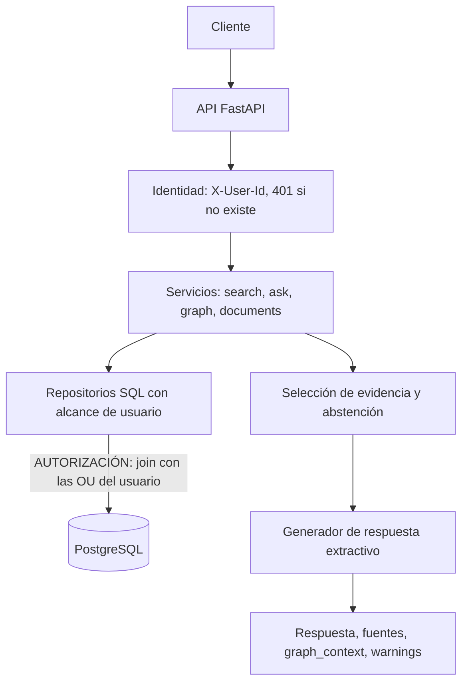

# Diseño de la solución: Docuvex Challenge Técnico

Fecha: 2026-10-05
Estado: implementado, incluido lo opcional (ver secciones 2, 5.3 y 15)

## 1. Objetivo y criterio de éxito

Construir una versión acotada de un buscador inteligente de documentos con Memoria Grafo, donde un usuario solo ve información de sus unidades organizacionales (OU) por cualquier vía: búsqueda, respuesta, evidencia o grafo.

La entrega se considera lograda cuando:

1. Se levanta con `docker compose up --build` siguiendo el README.
2. Los 19 casos del Anexo B pasan contra la API, sin ninguna filtración.
3. Los tests T01 a T13 existen, llevan el ID de la regla en el nombre y pasan sin Internet ni API keys.
4. El README responde todos los puntos de la lista de la sección 14 del enunciado.

## 2. Alcance

| Entregable | Prioridad en el enunciado | Decisión |
|---|---|---|
| `POST /api/v1/search` | Obligatorio | Se implementa |
| `POST /api/v1/ask` | Obligatorio | Se implementa, modo extractivo |
| Aislamiento por OU | Obligatorio | Se implementa en la consulta SQL |
| Grafo y `GET /api/v1/graph/nodes/{id}/neighbors` | Obligatorio | Se implementa |
| Versión vigente y conflicto | Obligatorio | Se implementa |
| Modelo de datos y diagrama | Obligatorio | DDL en el repo, Mermaid en el README |
| Tests de la sección 12 | Obligatorio | Se implementan T01 a T13 y un equivalente de T14 |
| Ejecución con un comando | Obligatorio | Docker Compose, carga automática del dataset |
| Análisis de performance | Obligatorio, solo texto | Sección del README |
| GraphRAG en `/ask` | Recomendado | Se implementa |
| `GET /api/v1/documents/{id}` | Recomendado | Se implementa |
| Resolución de entidades | Recomendado | Se implementa con `GET /api/v1/graph/nodes?name=` |
| Registro de consultas `/ask` | Recomendado | Se implementa |
| LLM real | Opcional | Se implementa: modo simulado para tests y cliente de Claude (`llm.py`) |
| Extracción automática de entidades | Opcional | Se implementa por reglas, con confianza y revisión (`extraction.py`) |
| Frontend | Opcional | Se implementa: una página estática en `/` |

## 3. Stack

- Python 3.12 y FastAPI.
- PostgreSQL 16 como único almacén: documentos, búsqueda de texto completo y grafo.
- psycopg 3 con SQL escrito a mano. Las consultas de autorización se leen completas en un solo lugar, sin ORM que las oculte.
- pytest contra el PostgreSQL de Compose.
- Docker Compose con dos servicios: `db` y `api`.

Por qué un solo almacén: la profundidad máxima del grafo es 2, por lo que no se necesita un motor de grafos. Con todo en PostgreSQL hay un único mecanismo de autorización que cubre búsqueda y grafo, y no existe el riesgo de que dos almacenes queden desincronizados en permisos.

## 4. Arquitectura



Capas y responsabilidad de cada una:

| Capa | Responsabilidad | Depende de |
|---|---|---|
| `api/` | Rutas, validación del request, formato de error | Servicios |
| `auth` | Leer `X-User-Id`, comprobar que el usuario existe, entregar el `user_id` | Repositorio de usuarios |
| `services/` | Lógica de búsqueda, respuesta, versiones y traversal | Repositorios |
| `repositories/` | Todas las consultas SQL. Cada función exige `user_id` | PostgreSQL |
| `answering/` | Selección de evidencia, criterio de abstención, generador | Chunks ya autorizados |
| `seed/` | Carga de `data/dataset.json` | PostgreSQL |

## 5. Autorización

### 5.1 Dónde se aplica

En la consulta SQL. Toda función de repositorio que lee documentos, versiones, chunks, nodos o relaciones recibe `user_id` como parámetro obligatorio y hace join con `user_organization_units`. No existe una función de repositorio que lea estos datos sin alcance.

El cliente nunca envía OU. El alcance se resuelve en el servidor a partir del `user_id`.

### 5.2 Por qué ahí no se puede saltar

- Las filas no autorizadas no salen de la base de datos, así que ninguna capa posterior (ranking, generador, serialización, logs) puede olvidarse de filtrarlas.
- El filtro va antes del `ORDER BY` y del `LIMIT`, lo que cumple S3: el top-k se calcula solo sobre lo autorizado.
- El generador de respuestas recibe únicamente chunks devueltos por esas consultas, lo que cumple S4.

### 5.3 Segunda barrera: Row-Level Security

Políticas de PostgreSQL sobre `documents`, `document_versions`, `chunks`, `graph_nodes`, `graph_edges` y `entity_attributes`. Tras validar al usuario, cada request corre con el rol `docuvex_app` y el `user_id` fijado en la transacción. Si una consulta olvidara el join de alcance, la base de datos igual no entregaría filas ajenas; un test lo comprueba quitando el filtro.

### 5.4 Cómo se cumple cada regla

| Regla | Mecanismo |
|---|---|
| S1 | Join con las OU del usuario en todas las consultas |
| S2 | El chunk de OU-002 no entra al ranking de user-a, sin importar su puntaje |
| S3 | Filtro antes de `ORDER BY` y `LIMIT` |
| S4 | El generador solo recibe chunks autorizados. Test que inspecciona su entrada |
| S5 | Un único manejador produce el 404, con cuerpo constante. No hay conteos de elementos ocultos |
| S6 | Logs estructurados con IDs, tiempos y largo de la consulta. Nunca contenido ni el texto de la pregunta |

## 6. Modelo de datos

```sql
organization_units(id PK, name)
users(id PK, name)
user_organization_units(user_id FK, ou_id FK, PK(user_id, ou_id))

documents(id PK, name, ou_id FK,
          current_version_id, has_version_conflict)
document_versions(id PK,            -- 'doc-001@v3'
                  document_id FK, version, is_current, effective_date,
                  UNIQUE(document_id, version))
chunks(id PK, version_id FK, document_id FK, page, bbox int[], content,
       tsv tsvector)                -- contenido (peso A) + nombre del documento (peso B)

graph_nodes(id PK, type, label, document_id NULL, ou_id NULL)
entity_aliases(node_id FK, alias, normalized)
entity_attributes(node_id FK, key, value, source_document_id, source_chunk_id)
graph_edges(id PK, from_id FK, to_id FK, relation, kind NULL,
            source_document_id, source_chunk_id NULL,
            extraction_method, confidence)

ask_log(id PK, user_id, question, abstained, warnings, created_at)
ask_log_sources(ask_id FK, chunk_id, position)
```

Índices: `documents(ou_id)`, `chunks(version_id)`, GIN sobre `chunks.tsv`, `graph_edges(from_id)`, `graph_edges(to_id)`, `graph_edges(source_document_id)`, `entity_aliases(normalized)`.

Preguntas de la sección 10.2 y qué las resuelve:

| # | Pregunta | Consulta o índice |
|---|---|---|
| 1 | OU de un documento | `documents.ou_id`, por clave primaria |
| 2 | Acceso de un usuario a un documento | Join `documents` con `user_organization_units` por su clave primaria |
| 3 | Chunks de la versión vigente | `documents.current_version_id` y el índice `chunks(version_id)` |
| 4 | Evidencia que originó una respuesta | `ask_log_sources` por `ask_id` |
| 5 | Documentos visibles que referencian una entidad | `graph_edges(to_id)` con `relation = 'REFERENCES'`, más el join de alcance |
| 6 | Origen de una relación | Columnas `source_document_id` y `source_chunk_id` de `graph_edges` |

`current_version_id` y `has_version_conflict` son datos derivados que se calculan al cargar. Riesgo conocido: deben recalcularse cada vez que se ingresa una versión.

## 7. Búsqueda

- Técnica: texto completo de PostgreSQL en español. Cada chunk indexa su contenido y el nombre de su documento.
- La consulta combina los términos con OR. Con AND, una sola palabra de la pregunta que falte en el chunk lo descarta. Buscando solo en el contenido, "¿Cuál es la duración del contrato con GPS Legal?" no devuelve nada, porque "GPS Legal" no aparece en el chunk de la duración. Indexar el nombre del documento lo rescata, pero basta agregar una palabra más a la pregunta para volver a cero resultados.
- Solo se devuelven chunks que coinciden con al menos un término.
- Por defecto solo versiones vigentes. `include_history: true` incluye las anteriores.
- `score`: fracción de los términos de la consulta que el chunk cubre. Un término en el contenido suma 1, uno que solo está en el nombre del documento suma 0,5, y la suma se divide por la cantidad de términos. Rango de 0 a 1.
- Desempate determinista: `ts_rank_cd` y luego `chunk_id`.
- Por qué no embeddings: exigen descargar un modelo, alargan la construcción y son más difíciles de explicar en un corpus de 13 chunks. El README describe la búsqueda híbrida como siguiente paso.

Cambio respecto del primer borrador: el score iba a ser `ts_rank_cd` normalizado. Se reemplazó por la cobertura de términos porque con `ts_rank_cd` el chunk de comparecencia (que repite "GPS Legal") podía superar al de la duración, y porque un score de cobertura se explica sin conocer el algoritmo interno de PostgreSQL.

Riesgo conocido: la búsqueda léxica no reconoce sinónimos ("sueldo" y "remuneración").

## 8. Respuesta, evidencia y abstención

- Modo extractivo. La respuesta es el texto literal del mejor chunk autorizado, de modo que `evidence` siempre es una subcadena exacta de `content` (R1, R2).
- Criterio de abstención (R4): si ningún chunk autorizado alcanza un score de 0,6, el sistema se abstiene con el texto exacto del enunciado. Un solo número sirve para ordenar y para decidir la abstención.
- R6: como la consulta solo ve chunks autorizados, una respuesta que existe solo en otra OU produce la misma abstención que una pregunta sin respuesta en el corpus.
- R5: después de generar se verifica que cada cita apunte a un chunk entregado al generador y que su evidencia sea literal. Si no calza, abstención. La interfaz del generador permite reemplazarlo por uno con LLM sin tocar esta verificación.
- Cada llamada a `/ask` se guarda en `ask_log` con sus fuentes.

## 9. Versionamiento

Regla de versión vigente: entre las versiones con `is_current = true`, se elige la de `effective_date` más reciente y, si empatan, la de número de versión mayor. Si ninguna está marcada, se aplica el mismo orden sobre todas.

Conflicto (doc-008): hay conflicto cuando más de una versión está marcada como vigente. El sistema aplica la misma regla, usa solo la versión elegida (45.000 pesos, versión 2), cita solo chunks de esa versión y agrega `VERSION_CONFLICT:doc-008` en `warnings`.

Justificación: la fecha de vigencia más reciente es la interpretación más probable y la advertencia deja el conflicto a la vista. La alternativa de abstenerse es más conservadora, pero deja al usuario sin respuesta por un problema de calidad de datos que sí se puede señalar.

## 10. Memoria Grafo

### 10.1 Construcción

- Nodos `Document`, `Version` y `OrganizationUnit` derivados de las tablas.
- Nodos `Company` y `Person` desde `graph_seed.entities`.
- Relaciones `BELONGS_TO`, `HAS_VERSION` y `SUPERSEDES` derivadas de `documents`, con el propio documento como procedencia.
- Relaciones `REFERENCES`, `RELATED_TO` y `REPRESENTS` desde `graph_seed.relations`, con `extraction_method = 'seed'` y `confidence = 1.0`.

### 10.2 Visibilidad y traversal

La idea central: primero se calcula el subgrafo visible del usuario y el recorrido ocurre solo dentro de él. Un nodo o relación oculta no existe para el traversal, así que no puede servir de puente.

| Regla | Mecanismo |
|---|---|
| G1 | `Document` y `Version` son visibles si su documento está en una OU del usuario |
| G2 | Una entidad es visible si existe una relación `REFERENCES` desde un documento autorizado. Los atributos se muestran solo si su documento de origen está autorizado |
| G3 | Una relación es visible si sus dos extremos son visibles y su `source_document_id` está autorizado |
| G4 | El recorrido usa solo relaciones visibles. doc-006 no se alcanza desde doc-001 porque el único camino pasa por doc-005 |
| G5 | Cada vecino lleva `path` (con la dirección original de cada relación) y `provenance` por cada paso |
| G6 | No se devuelven conteos ni grados. Cualquier total se calcula sobre lo visible |
| G7 | Profundidad máxima 2, máximo 50 nodos, conjunto de visitados para tolerar ciclos, orden determinista |

Decisiones adicionales:

- Las relaciones se guardan con dirección, pero el recorrido es en ambos sentidos. Sin esto, la empresa GPS Legal no tendría vecinos.
- Los nodos `OrganizationUnit` son visibles solo para usuarios de esa OU.
- El parámetro `relation` filtra todas las relaciones del camino.
- La respuesta no incluye los alias de una entidad, porque no tienen procedencia y podrían provenir de un documento de otra OU.
- Nodo inexistente o no visible: mismo 404.

### 10.3 Resolución de entidades

`GET /api/v1/graph/nodes?name=...` normaliza el texto (minúsculas, sin tildes, sin puntuación) y lo compara con el nombre y los alias declarados. Devuelve el nodo solo si es visible para el usuario.

Riesgo: una normalización más agresiva (quitar "SpA", "Ltda.") o una comparación por similitud puede fusionar dos empresas distintas. Por eso se usa solo coincidencia exacta tras normalizar.

### 10.4 GraphRAG en `/ask`

Con `use_graph: true`:

1. Se identifica el ancla: el documento del mejor chunk, siempre que la búsqueda supere el umbral o la pregunta nombre una entidad visible (por nombre o alias). El modo grafo se usa solo si la pregunta pide relaciones.
2. Traversal desde el ancla, profundidad máxima 2, solo relaciones `REFERENCES`, `RELATED_TO` y `REPRESENTS`. Se excluyen las estructurales porque un nodo de OU conecta todos los documentos de la unidad.
3. Se recuperan chunks vigentes de los documentos relacionados visibles.
4. La respuesta lista esos documentos, `sources` cita los chunks y `graph_context` contiene los caminos con su procedencia.

Si no hay ancla o no hay documentos relacionados, se sigue el flujo normal de `/ask`, que termina en abstención si no hay evidencia.

## 11. API y errores

- Se respeta el contrato de la sección 5 del enunciado: rutas, encabezado, campos y texto de abstención.
- La validación devuelve 400 con el formato de error del enunciado. FastAPI devuelve 422 por defecto, por lo que se reemplaza el manejador.
- 401 para encabezado ausente o usuario inexistente, en todos los endpoints.
- 404 con cuerpo constante.
- 500 genérico, sin detalles internos.
- Usuario sin OU: `/search` devuelve 200 con lista vacía, `/ask` se abstiene, el grafo devuelve 404.

## 12. Tests

| Test | Regla | Qué comprueba |
|---|---|---|
| T01 | 5.1 | Chunk correcto con todos sus metadatos |
| T02 | S1, S2 | chunk-003 no aparece para user-a |
| T03 | S3 | Con documentos ajenos más relevantes, se reciben `limit` resultados autorizados. Usa documentos adicionales de prueba |
| T04 | 4 | Usuario sin OU: 200 y lista vacía |
| T05 | 4 | 401 sin encabezado y con usuario inexistente |
| T06 | R3 | Abstención exacta |
| T07 | R6, S1 | Sueldo: abstención para user-a, sin texto filtrado |
| T08 | R1, R2 | `evidence` es subcadena exacta del chunk |
| T09 | 8 | 24 meses, no 12 ni 18 |
| T10 | 8 | Tres ejecuciones iguales y la advertencia de conflicto |
| T11 | G2, G3 | Vecinos de GPS Legal por usuario |
| T12 | G4 | doc-006 no aparece a través de doc-005 |
| T13 | S5 | 404 idéntico byte a byte |
| T14 | S4 | La entrada del generador solo contiene chunks autorizados |

Además, un archivo `tests/test_anexo_b.py` ejecuta los 19 casos de aceptación y revisa el cuerpo completo de cada respuesta en busca de los textos prohibidos.

## 13. Orden de construcción

| Paso | Contenido | Horas |
|---|---|---|
| 1 | Repo, Compose, esquema, carga del dataset | 1,5 |
| 2 | Identidad y formato de errores (T04, T05, A19) | 1 |
| 3 | `/search` con alcance y versión vigente (T01 a T03) | 2,5 |
| 4 | `/ask`, evidencia, abstención, registro (T06 a T08, T14) | 2,5 |
| 5 | Regla de versión vigente y conflicto (T09, T10) | 1 |
| 6 | Grafo: carga, subgrafo visible, vecinos (T11 a T13) | 3 |
| 7 | GraphRAG, resolución de entidades, `/documents` | 1,5 |
| 8 | Suite del Anexo B | 1 |
| 9 | README, diagrama, análisis de performance, `NOTAS.md` | 1,5 |

Un commit por paso como mínimo. Si el tiempo no alcanza, se recorta desde el paso 7 hacia atrás, siguiendo la sección 17 del enunciado.

## 14. Riesgos

| Riesgo | Mitigación |
|---|---|
| Error al transcribir el dataset desde el PDF | Verificar conteos: 8 documentos, 13 chunks, 5 entidades, 12 relaciones |
| Umbral de abstención mal calibrado | Tests T06, T07 y los casos A06 a A10 lo fijan |
| El raíz del analizador español no coincide entre pregunta y chunk | Mismo analizador para indexar y consultar, y test por cada pregunta del Anexo B |
| Filtración por un campo secundario (procedencia, camino, advertencia) | La suite del Anexo B revisa el cuerpo completo |

## 15. Agregado después del primer diseño: lo opcional

**Extracción por reglas.** Corre al cargar, después del seed. Dos niveles: menciones de entidades conocidas (confianza 0,9, visibles) y entidades descubiertas por patrón (confianza 0,6, `confirmed = false`, invisibles hasta revisión). El grafo solo muestra relaciones con confianza de 0,8 o más y entidades confirmadas. Una entidad pendiente no se confirma por repetirse.

**Generador con LLM.** Misma interfaz que el generador extractivo. El prompt contiene solo chunks autorizados que superaron el umbral. La salida pasa por dos verificaciones: citas literales de chunks entregados y con largo mínimo, y respuesta sustentada (cifras presentes en la evidencia y vocabulario compartido). Si el modelo falla, se responde por el camino extractivo con `LLM_UNAVAILABLE`.

**Frontend.** Una página estática con dos columnas que envían la misma consulta como dos usuarios distintos. Sin dependencias ni recursos externos.
